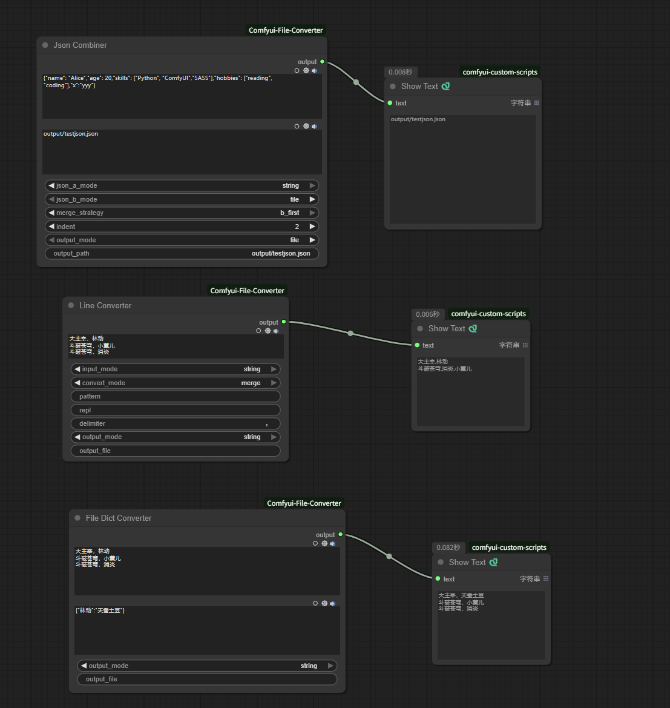

# ComfyUI-Anything-Converter

这是一个为 ComfyUI 设计的自定义节点扩展，提供了 JSON 合并和文本行转换功能。

### 概述

`ComfyUI-Anything-Converter` 包含以下主要节点：

Json:
- **Json Combiner**：合并两个 JSON 文件或字符串。
- **Json Parser**：解析任何 json 字符串为 json 对象。

File:
- **Line Converter**：按行正则替换或字符串处理文本。
- **File Dict Converter**：替换文件中的存在于 dict 中的 key 为对应的 value。
- **File Splitter**：根据给定的正则匹配，按匹配的内容前一行或者后一行换行符分割文件，分割成两个文件。

Image:
- **ImageConverter**：参考ComfyUI-KJNodes:Save Image KJ实现，可以获取所有图片的路径

### 安装

1. 克隆或下载此仓库到本地。
2. 将 `ComfyUI-Anything-Converter` 文件夹放入你的 ComfyUI 项目的 `custom_nodes` 目录中。
3. 重新启动 ComfyUI 以加载新节点。

### 使用方法

- 在 ComfyUI 的节点列表中找到 `Json Combiner` 和 `Line Converter` 节点，并将它们拖放到画布上。
- 配置节点参数并运行工作流，以确保一切正常工作。
- 查看 workflow.json:
  

### 贡献

欢迎贡献代码或报告问题。请提交 Pull Request 或在 Issues 中提出您的问题。
